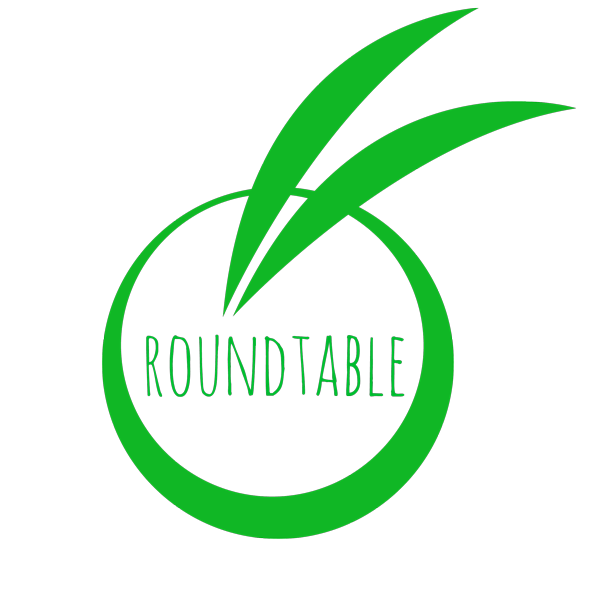

## Sobre el proyecto

El proyecto esta construido utilizando como base el framework de php [Laravel](https://laravel.com/docs/5.8) en su versión 5.8, como se puede observar en el registro de paquetes `composer.json` . Para la capa de frontend se utliza principalmente [Vue.js](https://vuejs.org/) en su versión 2.6 como framework de javascript además de otras librearías incluidas en el `package.json`. En la capa de persistencia se ha utilizado MySQL en la versión 5.7.

Además se utlizan los siguientes servicios para complementar la funcionalidades requeridas.

-   [Culqi](https://www.culqi.com/), como capa de gestión de transacciones en línea.
-   [Pusher](https://pusher.com/), para los mensaje asíncronos en tiempo real.
-   [TokBox](https://tokbox.com/), que provee canales de telecomunicación en tiempo real.

Antes de correr el proyecto en un entorno de desarrollo o producción es necesario que se cumplan los [requirimientos](https://laravel.com/docs/5.8/installation#server-requirements) que exige Laravel 5.8 para su funcionamiento

## Correr el proyecto

Primero necesario clonar el proyecto desde github  
`git clone https://github.com/eliasg1025/Roundtable.git`  
Paso seguido se debe configurar un base de datos en el archivo `.env`, si la base de datos se llama por ejemplo <i>roundtable</i> el archivo de configuracion deberia ir de la siguiente forma:  

`DB_CONNECTION=mysql` 
`DB_HOST=127.0.0.1` 
`DB_PORT=3306` 
`DB_DATABASE=roundtable` 
`DB_USERNAME=NOMBRE_USUARIO` 
`DB_PASSWORD=CONTRASEÑA`  

Paralelamente, se deben ejecutar los comandos `composer install` y `npm install` para traer todos paquetes necesarios para php y js.
Una vez finalizado la instalación de los paquetes se deben correr los comandos de `php artisan generate:key && php artisan migrate --seed` para generar las tablas en la base de datos.

Si se quiere correr en proyecto en un entorno de pruebas se puede correr `php artisan serve` el cual utliza el cliente de php para crear un servidor en el puerto 8000.

Finalmente si se quieren realizar cambios en los archivos del frontend se debe correr `npm run watch` o `npm run dev`. Para subir el proyecto a producción es necesario correr `npm run prod` para minificar los archivos.
